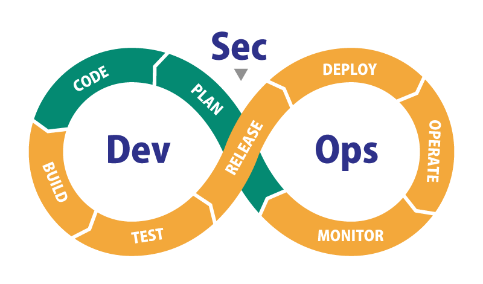

# Ops Frontier

Ops Frontier は DevSecOps を実行するためにユーザ、運用保守担当者、開発者の間のコニュニケーションを円滑にし、サービス管理をサポートするプラットフォームです。

:::warning
上記の図は https://www.rworks.jp/cloud/azure/azure-column/azure-entry/30128/ からダウンロードしたものであるため、著作権上の問題があり、配布に使用してはならない。
近日中に置換予定です。
:::

:::warning
ロゴマーク及びfavicon は <a target="_blank" href="https://icons8.com/icon/BejoiOeRfYSo/devops">Devops</a> アイコン by <a target="_blank" href="https://icons8.com">Icons8</a>　です。近日中に置換予定です。
:::